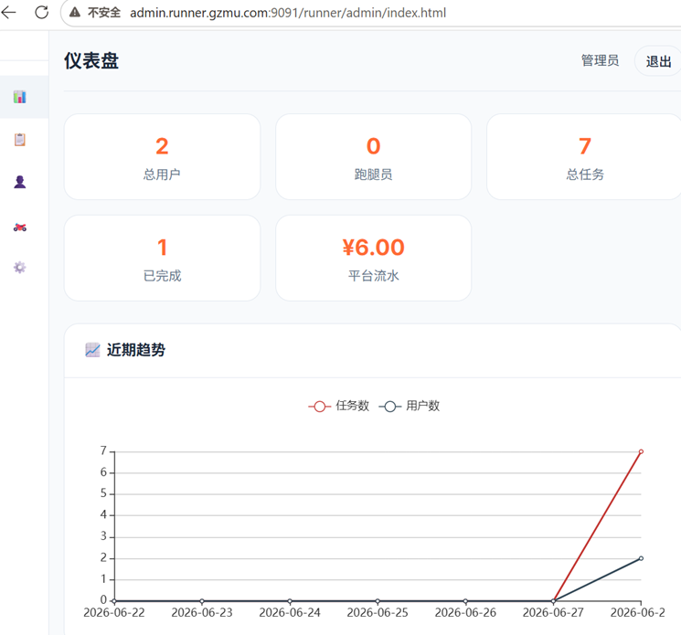

# 🏃 校园闪电侠 · 校园跑腿平台


> 基于 Spring Boot 微服务架构的校园跑腿服务平台。

---

## 📸 项目截图

### 首页任务大厅


### 钱包充值


### 管理后台



---

## ✨ 核心功能

- ✅ 用户注册/登录（支持密码登录）
- ✅ 角色切换（普通用户 / 跑腿员）
- ✅ 任务发布（含高德地图选点）
- ✅ 任务接单 / 送达 / 完成
- ✅ 跑腿员申请（含人脸录入）
- ✅ 钱包充值（支付宝沙箱支付）
- ✅ 钱包提现（自动打款）
- ✅ 个人中心（头像上传、信息编辑、手机号修改、密码修改）
- ✅ 消息通知
- ✅ 管理后台（仪表盘、任务管理、用户管理、跑腿员审核）

---

## 🛠️ 技术栈

| 层级 | 技术 |
|:---|:---|
| 前端 | HTML + CSS + JavaScript |
| 后端 | Spring Boot 2.2.5 + MyBatis |
| 数据库 | MySQL 8.0 + Redis + MongoDB |
| 文件存储 | FastDFS + 阿里云 OSS |
| 第三方 | 高德地图 API、支付宝沙箱支付 |

---

## 🏗️ 微服务架构

| 服务 | 端口 | 说明 |
|:---|:---|:---|
| service-user | 8003 | 用户注册/登录/个人信息 |
| service-task | 8001 | 任务发布/接单/完成 |
| service-wallet | 8007 | 钱包充值/提现/交易记录 |
| service-admin | 8006 | 管理后台 |
| service-files | 8004 | 文件上传/人脸存储 |

---

## 💡 项目亮点

- **微服务架构**：5 个独立服务，通过 RESTful API 通信
- **沙箱支付**：集成支付宝沙箱，实现充值和提现
- **实时聊天**：任务双方即时沟通
- **人脸录入**：跑腿员申请时采集人脸
- **地图选点**：高德地图 API 定位取送件位置
- **管理后台**：数据统计、用户管理、跑腿员审核

---

## 🚀 快速启动

### 环境要求
- JDK 8+
- MySQL 8.0
- Redis
- MongoDB

### 启动步骤
1. 导入 `runner-dev.sql` 到 MySQL
2. 启动 Redis 和 MongoDB
3. 依次启动各微服务
4. 前端部署到 Tomcat webapps/runner

---

## 📁 项目结构

```
runner-dev/
├── runner-common/         # 公共模块（工具类、枚举）
├── runner-model/          # 实体模块（POJO、BO、VO）
├── runner-service-api/    # API 接口模块（配置、拦截器）
├── runner-service-user/   # 用户服务 (8003)
├── runner-service-task/   # 任务服务 (8001)
├── runner-service-wallet/ # 钱包服务 (8007)
├── runner-service-admin/  # 管理服务 (8006)
├── runner-service-files/  # 文件服务 (8004)
├── runner/                # 前端页面
│   ├── portal/            # 用户端
│   ├── admin/             # 管理后台
│   └── runner/            # 跑腿员端
├── screenshots/           # 项目截图
│   ├── home.png           # 首页
│   ├── wallet.png         # 钱包
│   └── admin.png          # 管理后台
├── runner-dev.sql         # 数据库 SQL
└── pom.xml                # Maven 父工程
```

---

## 📄 默认账号

| 角色 | 账号 | 密码 |
|:---|:---|:---|
| 管理员 | admin | 123456 |
| 普通用户 | 13234567890 | 111111 |

---

## 👤 作者

- GitHub: [worship114514](https://github.com/worship114514)

---

## 📝 License

MIT
